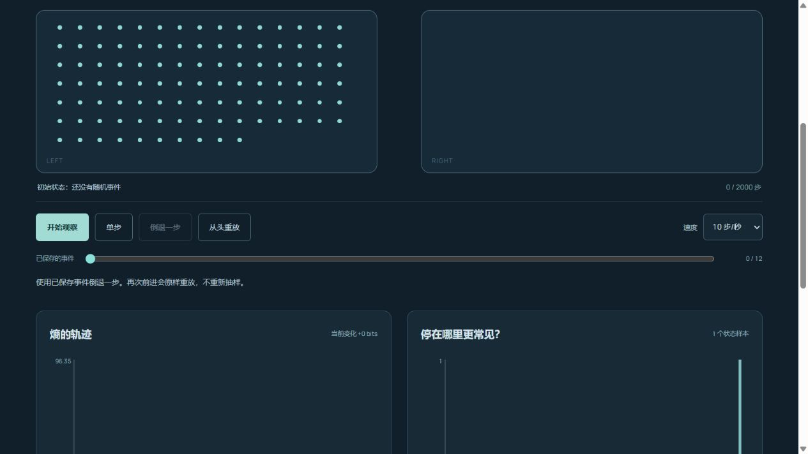

# Entropy Lab · 熵与时间

[在线体验](https://wangchuan2003-a11y.github.io/entropy-lab/) · [模型说明](docs/REFERENCES.md)



**每一步都是随机的，为什么宏观上常常走向平衡？**

观察20–300个有标签粒子在两个箱子之间变化。播放、单步、倒退与重放同一条轨迹，比较宏观熵曲线、经验直方图和理论二项分布。

## 真实模型

- Ehrenfest 双箱模型的 **lazy 变体**：每步均匀选择一个粒子，再独立以50%概率换箱、50%概率保持。不是基本模型中每一步都换箱的版本。
- 若左箱有 k 个粒子，减少、保持、增加的概率分别为 `k/(2N)`、`1/2`、`(N-k)/(2N)`。粒子总数始终为N。
- 显示 `S = log₂ C(N,k)`，使用log-factorial计算；它是宏观多重度的对数（bits），不是真实热力学熵单位。
- 理论平稳分布为 `Binomial(N, 1/2)`，在log空间计算并归一化。有限、相邻相关的样本不等于定理验证；全左初态还存在过渡过程。
- 每步保存粒子标签、换箱事件和随机状态。倒退后前进读取已保存事件，完整恢复微观状态；这不是自然过程自发逆转。

最多记录 **2,000步**，到达上限暂停。改变N、种子或初态会重开。初态可全部在左或近似平衡（奇数N时左侧为floor(N/2)）。熵会波动，不保证每一步增加。

## 数据与交互

URL分享初始N、种子与初态，不分享播放位置。CSV导出当前光标之前的状态，含初态，字段为 `step,n_left,n_right,macro_entropy_bits`。直方图使用同一轨迹前缀；重放不重复计样本。坐标仅区分粒子标签，模型没有空间、碰撞、能量或温度。

所有设置和控制可通过键盘操作，手机下图表纵向排列。计算、导出与分享均在浏览器内，无API、账号、追踪或模型上传。没有自动保存；重要轨迹请导出CSV，保存种子可重复生成。

## 本地运行

需要Node.js 22：

```sh
npm ci
npm run dev
```

开发地址：[http://127.0.0.1:5200](http://127.0.0.1:5200)。

```sh
npm test
npm run build
npx playwright install chromium
npm run test:e2e
```

浏览器测试自动启动生产预览 [http://127.0.0.1:4200](http://127.0.0.1:4200)，需要先构建。CI执行Node测试、构建和桌面/手机Chromium用例；仅main非PR运行在通过后部署Pages。Pages来源设为GitHub Actions。

[模型参考与边界](docs/REFERENCES.md) · [MIT](LICENSE) © 2026 wangchuan2003-a11y
